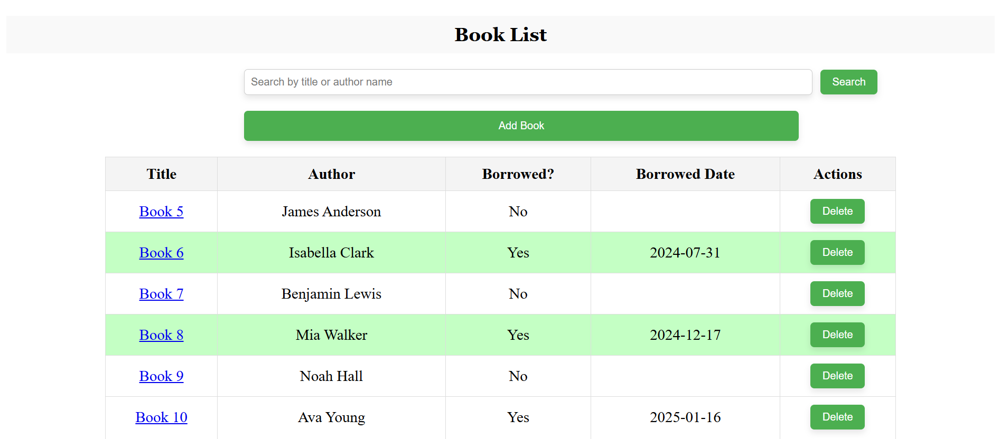
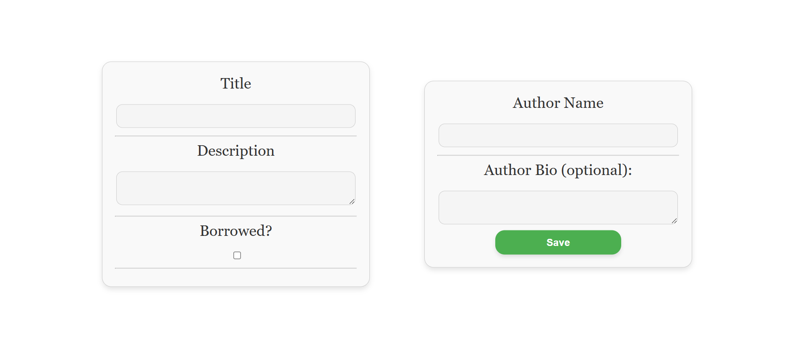
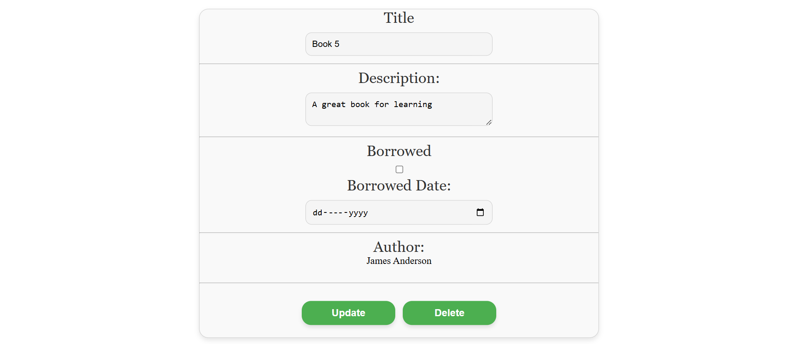

# Library Management System
- Add, update, delete, and search books and authors.
- Link authors to books.
- Highlight books borrowed for more than a month.
- Search by book title or author name.

### Homepage (List all the books & Search & Add book button / you update a book by clicking on it's Title)

### Add Book Form

### Update & Delete Form

